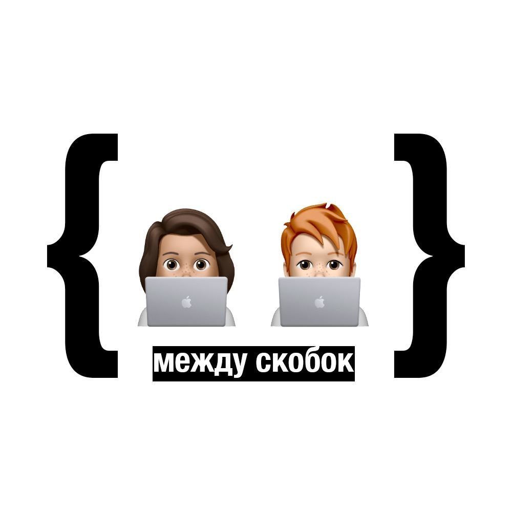

# Между скобок

## О клубе

Книжный клуб { между скобок } для backend разработчиков.
Накопилась гора книг? Одному сложно заставить себя читать? Нужен систематический подход? Тогда добро пожаловать в книжный клуб! Обсуждаем, делимся впечатлениями и ревьюим друг друга.

### System Design Doodle

Встретимся на публичное собеседование по системному проектированию, в рамках которого мы будем разрабатывать Doodle - приложение для организации и координации встреч.

На собеседовании вы сможете увидеть процесс разработки системы, начиная от определения требований и функциональности приложения, до проектирования базы данных и выбора подходящих технологий. Мы рассмотрим различные аспекты системного проектирования, такие как масштабируемость, производительность и надежность, и постараемся найти наилучшие решения для нашего проекта.

### Основы архитектуры ПО. Глава 16 Orchestration-Driven Service-Oriented архитектура

Мы обсудили оркестрацию в event-driven архитектуре. Рассмотрели концепцию единого orchestration engine, который объединяет enterprise service bus и многоуровневую структуру сервисов, таких как business services, enterprise services и infrastructure services. Также обсудили проблемы данного подхода и альтернативные подходы к оркестрации, которые используются сегодня. Мы рассмотрели Camunda как полезный инструмент, но подчеркнули важность понимания его работы и использования.

